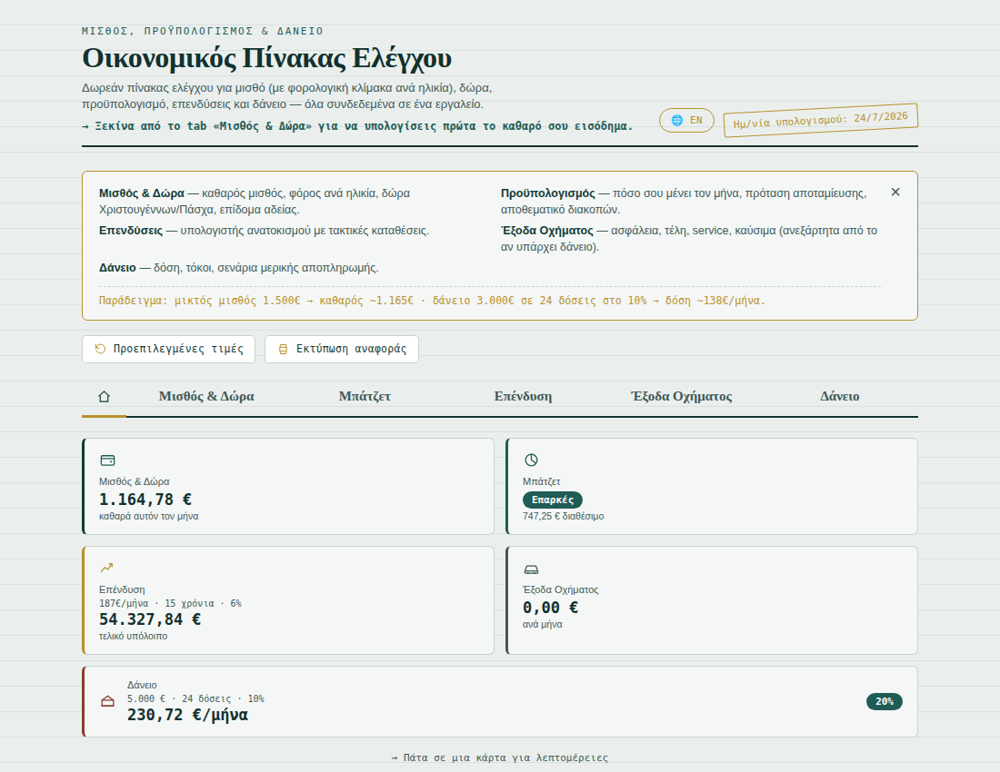
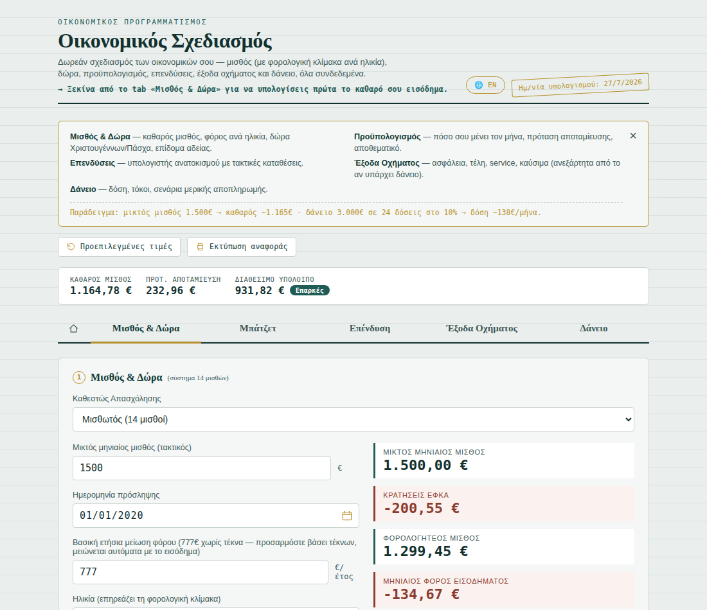
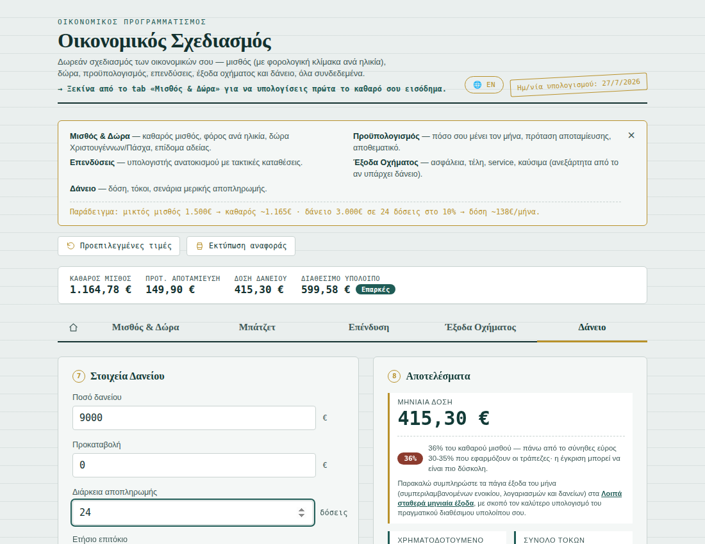
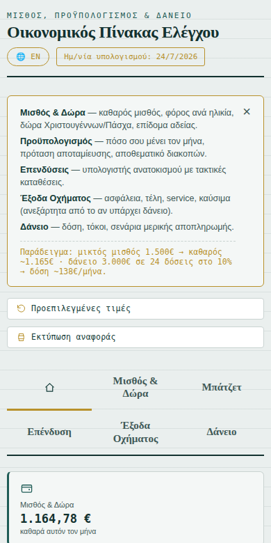

# Financial Planner (Οικονομικός Σχεδιασμός)

A free, bilingual (Greek/English) web dashboard for Greek payroll, loans, and personal budgeting. No sign-up, no backend, no tracking — everything runs client-side in the browser.

**Live site:** https://thgoulis.github.io/personal-finance-dashboard/

---

## Screenshots

| Dashboard (Hub) | Salary & Bonuses |
|---|---|
|  |  |

| Loan (with debt-to-income indicator) | Mobile view |
|---|---|
|  |  |

---

## What it does

Landing on the site opens a **dashboard** with five live summary cards — tap any card to jump into its full tab. Everything is connected: your net salary flows into the budget, the budget's suggested savings flows into the investment calculator, and so on.

### Dashboard
- Five live cards (Salary, Budget, Investments, Vehicle Expenses, Loan), each showing its key number at a glance
- Tap a card to open the full tab; a home icon in the tab bar always brings you back

### Salary & Bonuses
Two employment types, selectable from a single dropdown:

**Salaried (14 or 12 payments)**
- Net salary calculation from gross, using the current Greek employee tax scale, with three age-based brackets:
  - Over 30 (standard scale)
  - 26–30 years old (flat 9% up to €20,000, then standard scale)
  - Up to 25 years old (0% tax up to €20,000, then standard scale)
- An insurance-category selector (standard / heavy & unhealthy occupations / underground & underwater work) auto-fills the EFKA contribution rate, still editable manually
- Christmas bonus, Easter bonus, and leave allowance, prorated automatically by hire date (14-payment system only — hidden entirely for 12-payment employees, who have no such bonuses)
- Overwork (+20%), overtime (+40%), and holiday-work (+75% supplement) extra pay, taxed together with the regular salary through the same progressive scale but **exempt from EFKA contributions** for full-time employees (per Law 5184/2025, confirmed against the Ministry of Labour and multiple independent payroll sources)
- Annual tax credit tapering (€777 base, reduced €20 per €1,000 of income above €12,000)

### Budget
- Personal monthly budget: income, fixed expenses, available balance
- Savings percentage suggestion, feeding automatically into the investment calculator
- Reserve fund, fed by any bonus surplus left over after vehicle expenses — for vacations, unexpected costs, or any other goal

### Investments
- Compound-interest calculator: starting amount, regular contributions, rate of return, compounding frequency
- Year-by-year growth chart (contributions vs. growth)

### Vehicle Expenses
- Fixed annual costs (insurance, road tax, service) and operating monthly costs (fuel, parking, other)
- Fully independent of whether a loan exists — usable for a vehicle owned outright

### Loan
- French amortization schedule (fixed monthly payment), with yearly/monthly views
- Partial prepayment scenarios: shorten the term or lower the payment
- Debt-to-income indicator, flagging when the payment exceeds the 30–35% rule of thumb Greek banks typically use for loan affordability

---

## Design notes

- **No backend, no build step.** Three plain files — `index.html`, `style.css`, `script.js`. Open `index.html` directly in a browser or host the folder anywhere that serves static files.
- **Bilingual.** A single toggle switches every label, tip, and generated report between Greek and English. Currency formatting adapts to the selected language's locale.
- **Input validation.** Numeric fields are clamped to sensible bounds (percentages capped at 100%, non-negative amounts, etc.) on blur.
- **Printable report.** A dedicated print view summarizes the active tabs into a clean, non-interactive report.
- **No walls of zeros.** Results that depend on data you haven't entered yet are hidden, dashed-out with a short note, or shown as a live-updating "€0.00" — whichever fits the context — rather than a page full of meaningless zeros on first visit. See TECHNICAL.md §12 for the reasoning behind each choice.

## Disclaimer

This tool is provided for indicative purposes only, with no guarantee of accuracy. It does not constitute tax, legal, or financial advice. For decisions that commit you, consult a qualified professional (accountant, payroll manager, or bank advisor).

## Running locally

No installation needed — clone the repo and open `index.html` in any modern browser:

```bash
git clone https://github.com/thgoulis/personal-finance-dashboard.git
cd personal-finance-dashboard
open index.html   # or just double-click the file
```

## Deploying your own copy

The repo is set up for GitHub Pages (Settings → Pages → deploy from `main` branch, root folder). Any static host (Netlify, Vercel, Cloudflare Pages) works the same way — just upload `index.html`, `style.css`, and `script.js`.

## Testing

`tests/qa_tests.py` is a Playwright-driven regression suite that opens the app in a real headless browser and checks the core calculations (loan, salary/tax, investment growth), the dashboard's card-to-tab navigation, and mobile rendering across several widths and both languages.

`tests/lint_checks.py` is a separate, static check (no browser needed) for two specific bug patterns this project has hit more than once: nested `data-i18n` attributes, and a stale cache-busting version string relative to the actual file content.

```bash
pip install playwright
playwright install chromium
python tests/qa_tests.py
python tests/lint_checks.py
```

See [TECHNICAL.md](TECHNICAL.md) for what each check covers.

## Technical documentation

For an in-depth look at the calculation logic, architecture, and design decisions, see [TECHNICAL.md](TECHNICAL.md).

## License

MIT — see [LICENSE](LICENSE) for details.
